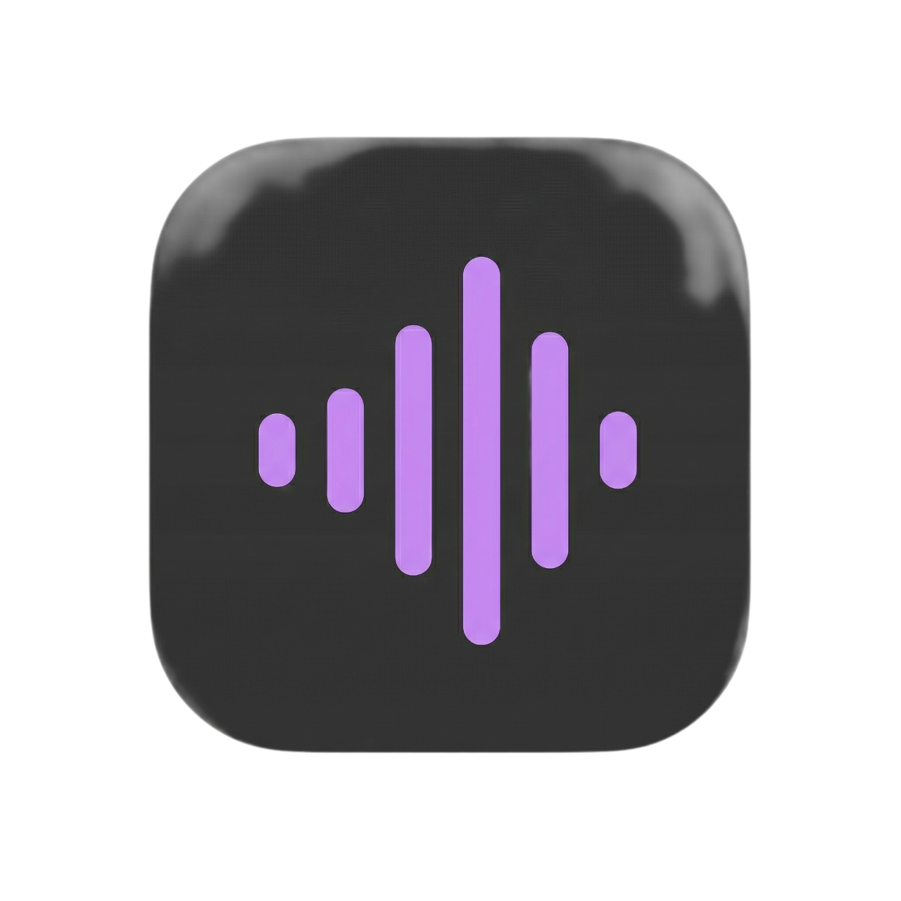

# 🎵 GIG Music Player

<p align="center">
  
</p>

A sleek, modern music streaming app built with **React Native** and **Expo**. GIG Music Player connects to the **Deezer API** to let you search, stream, and organize millions of tracks — all wrapped in a stunning dual-theme UI powered by the **Sonic Noir** design system.

---

## ✨ Features

### 🎧 Music Playback

- **Stream 30-second previews** from the Deezer catalog via `expo-av`
- **Full playback controls** — play, pause, skip, seek with a draggable progress bar
- **Shuffle & Repeat** modes (off → all → one)
- **Queue management** — songs are automatically queued from any list you play
- **Background audio** support (stays active in background & silent mode on iOS via `UIBackgroundModes`)
- **Mini Player** — persistent, floating mini player across all tabs
- **Smart Play/Pause** — Selecting a song that is already "Now Playing" will toggle playback (Play ⇋ Pause) instead of reloading it from the beginning
- **Active Song Indicators** — Visual "playing" animation overlay and Title color change for the active song across all lists (Trending, Search, Favorites, etc.)
- **Share** your favorite tracks directly using the native share sheet
- **Downloads & Offline Support** — save songs to local storage and enjoy seamless offline playback when you lose internet connection
- **Safe Area Support** — Adaptive UI that perfectly fits all device notches and home indicators
- **Smooth Transitions** — `ios_from_right` global navigation and `fade_from_bottom` player entrance
- **Shared Element Transitions** — Album art gracefully "morphs" between Mini Player and Full Player
- **Staggered Animations** — Song list items slide in with a fluid, staggered entrance effect
- **Full-Screen Gestures** — Swipe down from anywhere on the player to minimize it back to the bar


### 🔍 Search & Discovery

- **Real-time search** — instant results as you type (songs, artists, albums)
- **Trending charts** — top tracks from Deezer displayed on the Home screen
- **Genre browsing** — quick-tap genre cards (Pop, Rock, Hip-Hop, R&B, Electronic, Jazz)
- **Filter chips** — narrow results by category

### 📚 Library Management

- **Songs tab** — browse all available tracks with sort by name or artist
- **Playlists tab** — create, rename, and delete custom playlists
- **Favorites tab** — one-tap heart to save/unsave any song
- **Downloads tab** — acts as your local hub for all saved offline music
- **Search within library** — filter your personal collection

### 👤 User Profile & Settings

- **Authentication** — sign up & login with local persistence via `AsyncStorage`
- **Network Awareness** — real-time detection of connectivity to block online streams when offline
- **iOS Optimized** — pre-configured for background audio and silent mode playback
- **Haptic Feedback** — Tactile confirmation for likes and downloads via `expo-haptics`
- **User stats** — favorites count, playlist count, songs played


- **Dynamic Theme Engine** — instantly toggle between Dark, Light, and System modes
- **Information Modals** — accessible panels for Privacy Policy, Help & Support, and About info

### 🛠️ Personalization & Support

- **Developer Profile** — Dedicated "About the Developer" section featuring **Eslam Mahmoud**'s professional portfolio and technical expertise.
- **Interactive Support** — Clickable contact links in the "Help & Support" section for instant Email, Phone, LinkedIn, and GitHub access.
- **Brand Integration** — Official branding icons for Gmail, LinkedIn, and GitHub for a premium, production-ready feel.
- **Smooth Modals** — High-end bottom sheet modals with `3xl` rounded corners and interactive backdrop-to-close gestures.

### 🎨 Design

- **Sonic Noir** dynamic theme with vibrant purple/cyan (`#de8eff`/`#00f4fe`) accents
- **Premium Aesthetics** — modern `3xl` corner radii (32pt) for cards and modals, creating a soft, high-end look
- **Glassmorphism Lite** — subtle blur effects on Mini Player and overlay components
- **Gradient accents** — linear gradients on play button, progress bar, avatar ring, and brand accents
- **Edge-to-edge** layout on Android with `edgeToEdgeEnabled` and full safe area support on iOS

---

## 🏗️ Tech Stack

| Layer            | Technology                                                  |
| ---------------- | ----------------------------------------------------------- |
| **Framework**    | React Native 0.81 + Expo SDK 54                             |
| **Navigation**   | React Navigation 7 (Native Stack & Bottom Tabs)             |
| **Animations**   | react-native-reanimated                                     |
| **Audio**        | expo-av                                                     |

| **API**          | Deezer Public API                                           |
| **State**        | React Context (Auth, Player, Playlist, Theme, Network)      |
| **Persistence**  | @react-native-async-storage/async-storage                   |
| **File System**  | expo-file-system                                            |
| **Network**      | @react-native-community/netinfo                             |
| **Safe Area**    | react-native-safe-area-context                              |
| **Images**       | expo-image                                                  |

| **UI Effects**   | expo-linear-gradient, expo-blur, expo-haptics, expo-linking |
| **Language**     | TypeScript 5.9                                              |
| **Architecture** | React New Architecture enabled                              |
| **Developer**    | **Eslam Mahmoud** — Mobile Applications Engineer            |

---

## 📂 Project Structure

```
GIG_Music_Player/
├── screens/                 # All application screens
│   ├── HomeScreen.tsx       # Home — greeting, recently played, favorites, trending
│   ├── SearchScreen.tsx     # Search — real-time search, genre browse, filters
│   ├── LibraryScreen.tsx    # Library — Songs / Playlists / Favorites tabs
│   ├── ProfileScreen.tsx    # Profile — avatar, theme toggle, info modals, logout
│   ├── PlaylistDetailScreen.tsx   # Playlist detail — play all, shuffle, song list
│   ├── CreatePlaylistScreen.tsx   # Create new playlist form
│   ├── LoginScreen.tsx      # Login screen
│   ├── SignupScreen.tsx     # Sign-up screen
│   ├── PlayerScreen.tsx     # Full-screen Now Playing
│   ├── FavoritesScreen.tsx  # Dedicated favorites screen
│   └── RecentScreen.tsx     # Recently played history
├── navigation/
│   ├── TabNavigator.tsx     # Bottom tab navigator + MiniPlayer overlay
│   └── types.ts             # TypeScript types for all navigation stacks
├── components/
│   ├── MiniPlayer.tsx       # Floating mini player with playback controls
│   └── SongItem.tsx         # Reusable song row component
├── contexts/
│   ├── AuthContext.tsx       # Authentication state & persistence
│   ├── NetworkContext.tsx    # Connection state & offline checks
│   ├── PlayerContext.tsx     # Audio playback engine & queue state
│   ├── PlaylistContext.tsx   # Playlists, favorites, downloads & persistence
│   └── ThemeContext.tsx      # Dual-mode theme state (Light/Dark/System)
├── services/
│   ├── api.ts               # Deezer API client (search, charts, tracks, artists)
│   └── types.ts             # TypeScript interfaces (Song, Playlist, User, etc.)
├── constants/
│   └── theme.ts             # Sonic Noir design tokens (Light/Dark ColorPalettes)
├── App.tsx                  # Root component (Providers & Root Navigation)
└── babel.config.js          # Babel config with strict path aliases (@/ -> ./)
```

---

## 🚀 Getting Started

### Prerequisites

- **Node.js** ≥ 18
- **npm** or **yarn**
- **Expo CLI** — installed globally or via `npx`
- **Android Studio** (for Android emulator) or a physical device with **Expo Go**

### Installation

```bash
# Clone the repository
git clone https://github.com/your-username/GIG_Music_Player.git
cd GIG_Music_Player

# Install dependencies
npm install

# Start the development server
npx expo start
```

### Running on a Device

| Platform | Command                    |
| -------- | -------------------------- |
| Android  | `npx expo start --android` |
| iOS      | `npx expo start --ios`     |
| Web      | `npx expo start --web`     |

> **Tip:** Scan the QR code in your terminal with the **Expo Go** app on your phone for the fastest setup.

---

## 🎶 API

GIG Music Player uses the **[Deezer Public API](https://developers.deezer.com/api)** — no API key required.

| Endpoint               | Usage                    |
| ---------------------- | ------------------------ |
| `GET /search?q=`       | Search songs by query    |
| `GET /chart/0/tracks`  | Fetch trending tracks    |
| `GET /track/{id}`      | Get single track details |
| `GET /artist/{id}/top` | Get artist's top tracks  |

---

## 🎨 Design System — Sonic Noir

| Token        | Description                                               |
| ------------ | --------------------------------------------------------- |
| Philosophy   | A stark, premium two-tone system                          |
| Themes       | Supported `light` and `dark` with automatic OS sync       |
| Primary      | `#de8eff` (vibrant purple)                                |
| Secondary    | `#00f4fe` (electric cyan)                                 |
| Typography   | System default native fonts                               |
| Corner Radii | Pill-drops to soft squares                                |

---

## 📄 License

This project is private and not licensed for public distribution.

---

---

## 📬 Contact

<p align="center">
  <a href="mailto:xdev.eslam@gmail.com">
    
  </a>
  <a href="https://linkedin.com/in/deveslam-mahmoud">
    
  </a>
  <a href="https://github.com/DevEslam1">
    
  </a>
</p>

**Eslam Mahmoud** — *Mobile Applications Engineer*

---

<p align="center">
  Built with ❤️ by **Eslam Mahmoud**
</p>
