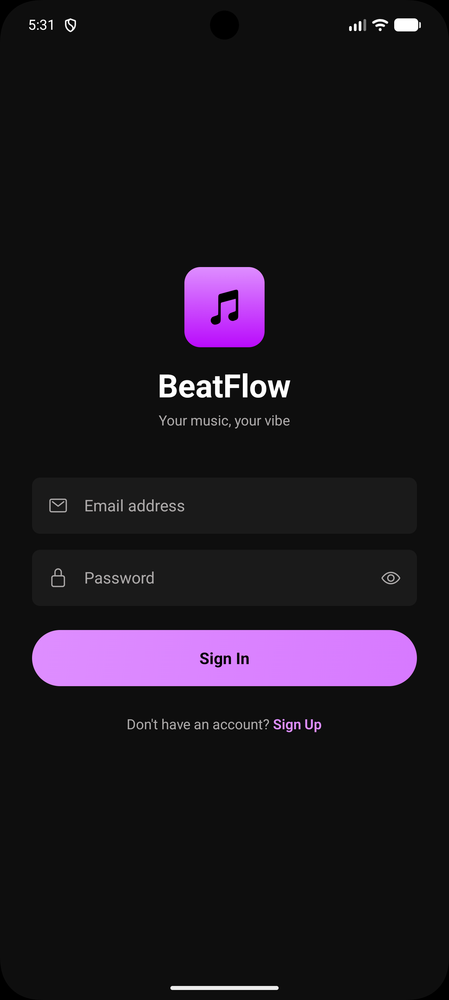
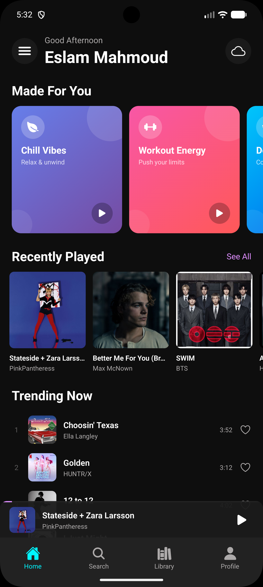
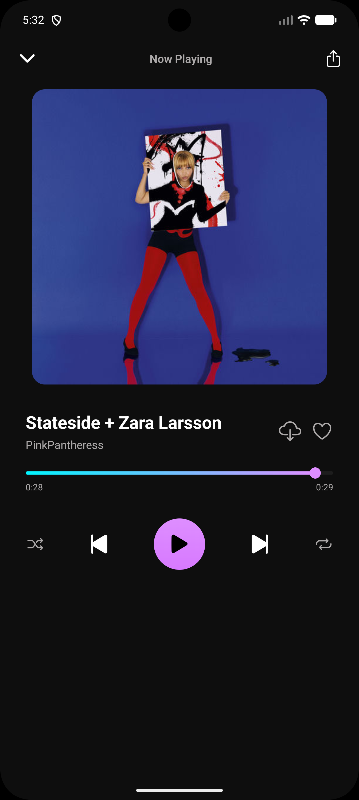
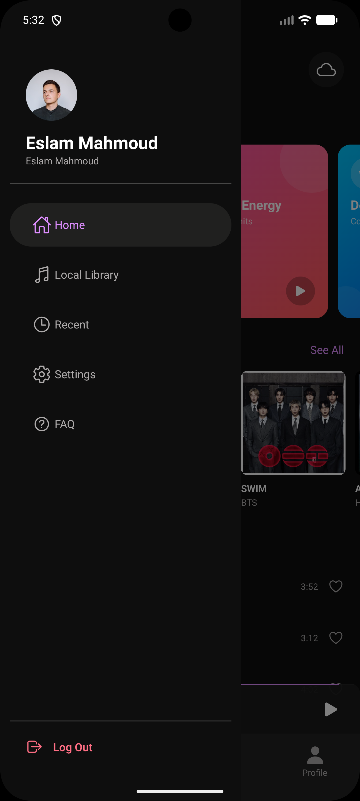
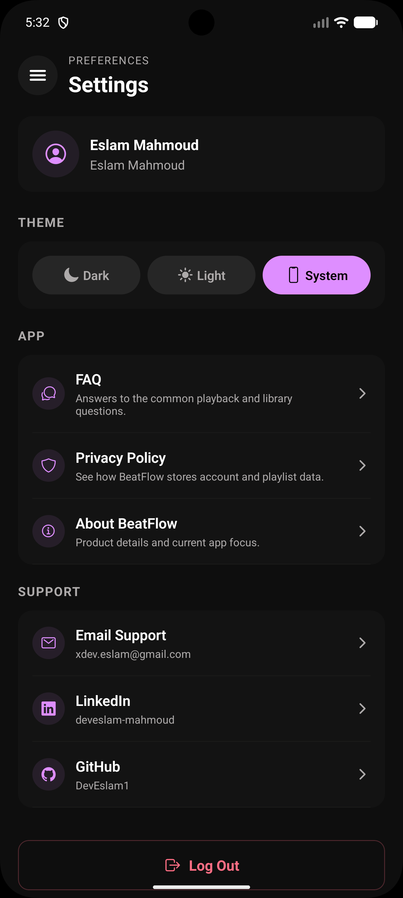

# BeatFlow

<p align="center">
  
</p>

BeatFlow is a React Native music player built with Expo. It combines Deezer preview streaming, offline downloads, local audio scanning, playlist management, and a polished mobile UI in one portfolio app.

The goal of this project is to show practical mobile engineering skills:

- building a multi-screen app with React Navigation
- managing app-wide state with React Context
- handling audio playback, queueing, and background behavior
- supporting offline scenarios and local device media
- shipping a consistent UI across authentication, library, player, and profile flows

## Screenshots

<p align="center">
  
  
  
</p>

<p align="center">
  
  
  
</p>

## What The App Does

- **Advanced Playback**: Streams Deezer previews with play, pause, seek, skip, shuffle, and repeat controls.
- **Background Audio**: Sustained background playback on Android and iOS with native system integration.
- **System Media Controls**: Support for lock screen and notification drawer controls (Now Playing metadata).
- **Persistent Mini Player**: Seamless music control while navigating the entire app.
- **Library Management**: Supports favorites, custom playlists, recently played tracks, and downloads.
- **Swipe Interactions**: Quick swipe-to-remove management for Favorites, Downloads, and Playlists with integrated haptic feedback.
- **Network Resilience**: Global connectivity monitoring with automatic 3s polling and a localized status banner for seamless UX during outages.
- **Offline Mode**: Detects connectivity and automatically switches to playing downloaded local content.
- **Local Media Scanning**: Scans device audio files to merge local and online libraries in one player experience.
- **Theming**: Fully theme-aware UI (Light, Dark, and System modes).

## Tech Stack

| Area | Choice |
| --- | --- |
| Framework | React Native 0.81 |
| Runtime | Expo SDK 54 |
| Language | TypeScript |
| Navigation | React Navigation 7 |
| Audio | `expo-audio` |
| Media Access | `expo-media-library` |
| Persistence | `@react-native-async-storage/async-storage`, `expo-file-system` |
| Network Awareness | `@react-native-community/netinfo` |
| UI | `expo-image`, `expo-linear-gradient`, `expo-blur`, `expo-haptics` |
| State Management | React Context |

## Architecture Summary

The app is organized by feature-focused layers:

- `screens/`: user-facing views such as Home, Search, Library, Player, Auth, and Profile
- `components/`: reusable UI such as the mini player and song list item
- `contexts/`: shared app state for auth, playback, playlists, theme, local tracks, and network status
- `services/`: API calls and shared data types
- `navigation/`: stack, tab, and drawer navigation definitions
- `constants/`: design tokens and theme values

This structure keeps UI, business logic, and shared state separated well enough for a medium-sized mobile app without adding unnecessary abstraction.

## Key Engineering Areas

### Playback & Background Tasks

- **Sustained Playback**: Implements `AudioControlsService` on Android and `UIBackgroundModes` on iOS to ensure the OS doesn't kill playback while in the background.
- **Lock Screen Integration**: Leverages `setActiveForLockScreen` (SDK 55 ready) to provide native Now Playing metadata and system-level media controls.
- **Queue Management**: Shared player state across screens through `PlayerContext`, handling dynamic queueing, seeking, and cross-screen synchronization.

### Offline And Local Media

- **Network Resilience**: Real-time monitoring with `NetInfo`. Implements a 3s polling strategy to force connectivity refreshes when offline, paired with a global `NetworkStatusBanner` for immediate user feedback.
- **Persistent Storage**: Downloaded audio management using `expo-file-system` and metadata persistence with Async Storage.
- **Media Mapping**: Device media scanning and classification to integrate local tracks into the player's unified data model.

### UI Architecture

- **Complex Navigation**: Nested navigation architecture involving Drawer, Bottom Tabs, and Native Stacks.
- **Design System**: Centralized `ThemeContext` providing dynamic design tokens for a consistent "premium" look.
- **Performance**: Optimized mini-player and list rendering to ensure smooth interaction during playback.

## Current Product Scope

This is a portfolio project, not a production service. A few parts are intentionally lightweight:

- Authentication is local/demo-oriented rather than backed by a real auth provider
- Streaming uses Deezer preview URLs, not full licensed playback
- The project currently focuses more on mobile product quality than backend depth

## Getting Started

### Prerequisites

- Node.js 18 or newer
- npm
- Android Studio emulator, iOS simulator, or Expo Go

### Install

```bash
git clone https://github.com/DevEslam1/BeatFlow.git
cd BeatFlow
npm install
```

### Build & Run
*Note: Because this app uses native background services and custom permissions, it requires a Development Build or local compilation (not standard Expo Go).*

```bash
# Prebuild native directories
npx expo prebuild

# Run on Android
npm run android

# Run on iOS
npm run ios
```

## API

BeatFlow uses the [Deezer Public API](https://developers.deezer.com/api).

Main endpoints used:

- `GET /search?q=`
- `GET /chart/0/tracks`
- `GET /track/{id}`
- `GET /artist/{id}/top`

## What I Would Improve Next

- Replace local demo auth with a real backend or hosted auth provider
- Add automated tests for contexts and service functions
- Add CI for linting and test execution
- Reduce Android permissions to the minimum required set
- Remove leftover template files and unused dependencies

## Contact

- Email: `xdev.eslam@gmail.com`
- LinkedIn: [linkedin.com/in/deveslam-mahmoud](https://linkedin.com/in/deveslam-mahmoud)
- GitHub: [github.com/DevEslam1](https://github.com/DevEslam1)
